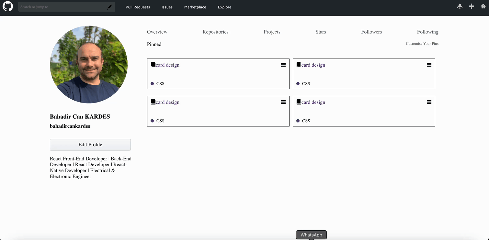

# github_profile_clone_SCSS

A simple, static GitHub profile page built to practice and learn SCSS.

# Preview

 

# 🧰 Technologies Used

- HTML5 : Used to structure the page, including sections for the profile, navigation, and pinned repositories. The layout is kept simple to ensure fast loading and accessibility.
- CSS3: The compiled output of SCSS, providing the final styling for the page, including responsive design elements and visual enhancements for the pinned cards.
- SCSS (Sass): Applied to write modular and reusable styles. SCSS features like variables (for consistent theming), nesting (for cleaner code), and partials (e.g., _content.scss, _formalise.scss) were used to organize the styles efficiently.

# 📧 Contact

- kardes126@gmail.com

